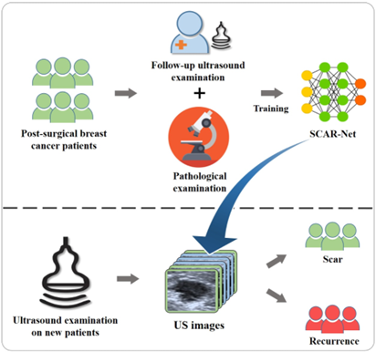

# SCAR-Net: Differentiating Postoperative Scars and Recurrent Lesions in Breast Cancer Ultrasound

## Introduction

### Purpose

To develop **SCAR-Net**, a deep learning model for differentiating between postoperative scars and recurrent lesions in breast cancer ultrasound images, and to evaluate the model’s diagnostic performance and its effectiveness in assisting radiologists.

## Methods

### Data Collection

Retrospectively collected 34,376 ultrasound images from 5,710 postoperative breast cancer patients across four hospitals.

### Dataset Division

- Training set: 5,019 cases  
- Validation set: 215 cases  
- External test set: 476 cases (from independent multicenter hospitals)

### Model Development

The SCAR-Net model was constructed and trained. Segmentation and classification performance were evaluated on both the validation and external test sets.

### Evaluation Metrics

- Area Under the Curve (AUC)  
- Sensitivity  
- Specificity  
- Positive Predictive Value (PPV)  
- Negative Predictive Value (NPV)  
- F1 Score  
- Dice Coefficient

### Radiologist Comparison

Diagnostic performance of six radiologists was evaluated both independently and with model assistance.

## Results

- **Radiologist AUC** improved from 0.810–0.824 to 0.939–0.942 with SCAR-Net assistance (p < 0.001).
- **Sensitivity** increased from 0.775–0.782 to 0.934–0.941 (p < 0.001).
- **Specificity** increased from 0.839–0.872 to 0.935–0.950 (p < 0.001).
- **Segmentation Accuracy**:
  - Dice coefficient on validation set: 0.918 (vs. baseline: 0.795)
  - Dice coefficient on external test set: 0.925 (vs. baseline: 0.811)
  - All improvements statistically significant (p < 0.001)

## Conclusion

The SCAR-Net model accurately segments and differentiates postoperative scars and recurrent lesions in ultrasound images of breast cancer patients. It significantly improves the diagnostic performance of radiologists and may serve as an effective auxiliary tool in the postoperative follow-up management of breast cancer, contributing to earlier and more accurate recurrence detection.

## Overall Research Workflow Diagram

<!-- Replace with your actual image path if available -->

